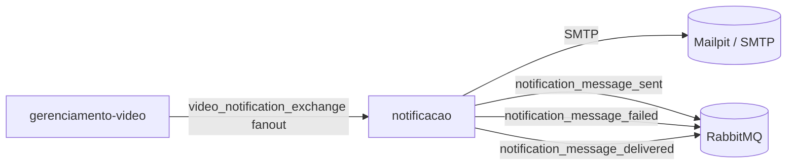
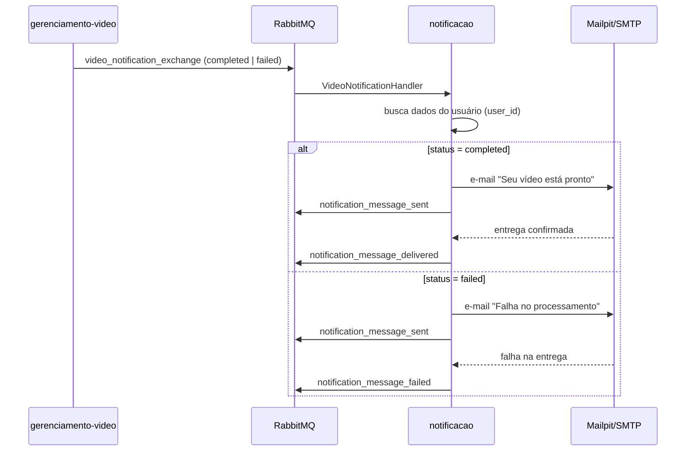

# fase05-notificacao

Microserviço responsável pelo envio de notificações ao usuário ao final do processamento de vídeo. Consome eventos do exchange `video_notification_exchange` (RabbitMQ) e envia e-mails transacionais com o resultado do processamento.

## Papel na arquitetura



### Posição no fluxo completo



## Responsabilidades

1. **Ouvir `video_notification_exchange`** — fanout RabbitMQ com payload `{ video_id, user_id, status, result_url, timestamp }`
2. **Enviar e-mail transacional** — notifica o usuário com o resultado do processamento
3. **Publicar eventos de auditoria** — `notification_message_sent`, `notification_message_delivered` ou `notification_message_failed`

## Contratos RabbitMQ

### Entrada: `video_notification_exchange` (fanout)

Publicado pelo `gerenciamento-video` ao concluir ou falhar o processamento.

Conclusão:

```json
{
  "video_id": "550e8400-e29b-41d4-a716-446655440000",
  "user_id": 1,
  "status": "completed",
  "result_url": "processed_videos/vid_550e8400....mp4.zip",
  "timestamp": "2026-06-19T12:00:00+00:00"
}
```

Falha:

```json
{
  "video_id": "550e8400-e29b-41d4-a716-446655440000",
  "user_id": 1,
  "status": "failed",
  "result_url": null,
  "timestamp": "2026-06-19T12:00:00+00:00"
}
```

Consumer: `php artisan notification:consume-video`

### Saída: eventos de auditoria

| Exchange / Fila | Quando |
|-----------------|--------|
| `notification_message_sent` | Imediatamente após tentativa de envio |
| `notification_message_delivered` | Confirmação de entrega pelo SMTP |
| `notification_message_failed` | Falha definitiva no envio (após retries) |

Payload padrão:

```json
{
  "video_id": "550e8400-e29b-41d4-a716-446655440000",
  "user_id": 1,
  "channel": "email",
  "status": "sent | delivered | failed",
  "timestamp": "2026-06-19T12:00:00+00:00"
}
```

## Stack técnica

- **Laravel 13** + **PHP 8.5+**
- **RabbitMQ** (`php-amqplib`) — consumo de eventos e publicação de auditoria
- **Laravel Mail** + **SMTP** — envio de e-mails transacionais
- **Mailpit** — servidor SMTP local para desenvolvimento e testes ([docs](https://mailpit.axllent.org/))
- **PostgreSQL** — persistência de log de notificações (opcional)
- **Docker / Docker Compose** — containerização

## Setup local

### Opção A — Docker (recomendado)

```bash
docker compose up -d --build
```

| Container | Função | Porta |
|-----------|--------|-------|
| `app` | Aplicação Laravel (PHP-FPM + nginx) | 8002 |
| `worker` | Consumer RabbitMQ | — |
| `rabbitmq` | Broker de mensagens | 5672 / 15672 |
| `mailpit` | SMTP local + UI de e-mails | 1025 (SMTP) / 8025 (UI) |
| `postgres` | Banco de dados | 5432 |

Acesse a caixa de entrada de teste em: http://localhost:8025

### Opção B — PHP no host

```bash
cp .env.example .env
composer install
php artisan key:generate
php artisan migrate
docker compose up -d   # apenas RabbitMQ + Mailpit + PostgreSQL
composer dev           # API + consumer
```

### Workers (inclusos no `composer dev`)

- `php artisan serve` — API REST (health check)
- `php artisan notification:consume-video` — consumer principal

## Variáveis de ambiente relevantes

| Variável | Descrição | Default (desenvolvimento) |
|----------|-----------|--------------------------|
| `RABBITMQ_HOST` | Host do RabbitMQ | `localhost` |
| `RABBITMQ_PORT` | Porta AMQP | `5672` |
| `RABBITMQ_USER` | Usuário | `guest` |
| `RABBITMQ_PASSWORD` | Senha | `guest` |
| `MAIL_MAILER` | Driver de e-mail | `smtp` |
| `MAIL_HOST` | Host SMTP | `localhost` |
| `MAIL_PORT` | Porta SMTP | `1025` |
| `MAIL_FROM_ADDRESS` | Remetente | `noreply@fase05.local` |
| `MAIL_FROM_NAME` | Nome do remetente | `Plataforma de Vídeo` |
| `DB_CONNECTION` | Driver do banco | `pgsql` |
| `DB_HOST` | Host do banco | `localhost` |
| `DB_DATABASE` | Nome do banco | `notificacao` |
| `NOTIFICATION_EXCHANGE` | Exchange de entrada | `video_notification_exchange` |

## Testes automatizados

```bash
composer test
```

Cobertura planejada:
- Handler RabbitMQ (`video_notification_exchange` — completed e failed)
- Envio de e-mail (`VideoProcessedMail`, `VideoFailedMail`) com `Mail::fake()`
- Publicação de eventos de auditoria (`sent`, `delivered`, `failed`)
- Retry em caso de falha SMTP

## Integração com outros microserviços

| Serviço | Integração |
|---------|-----------|
| `fase05-gerenciamento-video` | Publica em `video_notification_exchange` (fanout) ao concluir ou falhar o processamento |
| `fase05-cadastro-usuario` | Fonte dos dados de e-mail do usuário (via `user_id`) — a definir: chamada REST ou evento |

## Teste manual

1. Suba a infraestrutura: `docker compose up -d`
2. Inicie o consumer: `php artisan notification:consume-video` (ou via `composer dev`)
3. Publique um evento de teste no RabbitMQ Management UI (http://localhost:15672):
   - Exchange: `video_notification_exchange`
   - Payload: ver [contrato de entrada](#entrada-video_notification_exchange-fanout)
4. Verifique o e-mail recebido em http://localhost:8025 (Mailpit)
5. Confira os eventos de auditoria publicados nas filas `notification_message_sent` / `notification_message_delivered`
